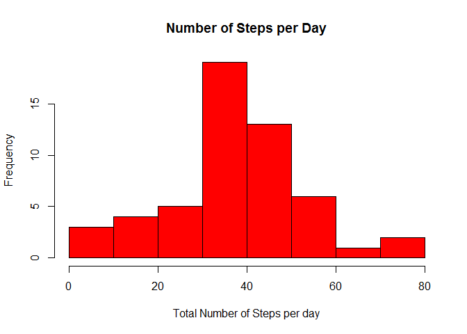
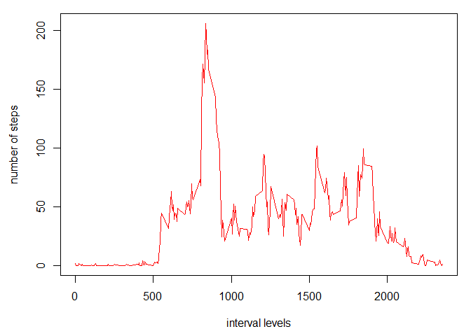

# Reproducible Research: Peer Assessment 1


## Loading and preprocessing the data


```r
setwd("C:\\Users\\Dario\\Documents\\GitHub\\RepData_PeerAssessment1")
suppressMessages(library(dplyr))
activity <- read.table(unz("repdata_data_activity.zip", "activity.csv"),
                       header = TRUE, sep = ",")
```

## What is mean total number of steps taken per day?


```r
stepsPerDay <- activity %>% select(date, steps) %>% group_by(date) %>% 
  summarize(mean(steps, na.rm = TRUE))
names(stepsPerDay) <- c("date", "sum")
```

1. Make a histogram of the total number of steps taken each day


```r
hist(stepsPerDay$sum, 
     freq = TRUE,
     col = 'red', 
     xlab = 'Total Number of Steps per day',
     breaks = 10,
     main = 'Number of Steps per Day')
```

 

```r
dev.copy(png, file = 'figures/plot1.png', height=480, width=480)
```

```
## png 
##   3
```

```r
dev.off()
```

```
## png 
##   2
```

```r
stepsPerDayMean <- mean(stepsPerDay$sum, na.rm = TRUE)
stepsPerDayMedian <- median(stepsPerDay$sum, na.rm = TRUE)
```

2. Calculate and report the mean and median total number of steps taken per day

Variable       |  mean       |         median
---------------|-------------|-----------------------
Steps Per Day  | 37.3826 | 37.3785

## What is the average daily activity pattern?

1. Make a time series plot of the 5-minute interval and the ave number steps


```r
intervalPerDayMean <- activity %>% group_by(interval) %>% 
  summarize(mean(steps, na.rm = TRUE))
names(intervalPerDayMean) <- c("interval", "MeanSteps")
intervalLevels <- levels(factor(activity$interval))
par(mar = c(4.5,4.5,1,1))
plot(intervalPerDayMean$MeanSteps ~ intervalLevels, type = "l",
     ylab = "number of steps", xlab = "interval levels", col = "red")
```

 

```r
dev.copy(png, file = 'figures/plot2.png', height=480, width=960)
```

```
## png 
##   3
```

```r
dev.off()
```

```
## png 
##   2
```

2. Which 5-minute interval on average contains the maximum number of steps


```r
max5MinMeanValue <- max(intervalPerDayMean$MeanSteps)
max5MinMeanRow <- which(intervalPerDayMean$MeanSteps == max5MinMeanValue)
max5MinMeanInterval <- intervalPerDayMean[row(intervalPerDayMean) == 
                                            max5MinMeanRow,][1,1]
```

**The (835) 5-minute interval contains 
206 maximum number 
of steps in average across all days: 
**

## Imputing missing values

1. Calculate and report the total number of missing values in the dataset


```r
iSteps <- which(is.na(activity[,1]) == TRUE)
jInterval <- activity[iSteps,3]
activity[iSteps, 1] <- intervalPerDayMean[,2]
```

**Total number of missing values rows in the dataset is: 2304**

2. Devise a strategy for filling in all of the missing values in the dataset.

   - Strategy is to fill in the missing values with the average of all existing
     values in a particular day


```r
missingvals = c(NA)
meanVector <- tbl_df(aggregate(activity$steps[!activity$steps %in% missingvals],
                               list(activity$date[!activity$steps %in% missingvals]), mean))
names(meanVector) <- c("date", "steps")
meanVector$date <- as.character(meanVector$date)
newActivity <- tbl_df(activity)
newActivity$date <- as.character(newActivity$date)


mutate(newActivity, steps = ifelse(steps == NA, 
                                   meanVector$steps[newActivity$date == 
                                                      meanVector$date], steps))
```

```
## Source: local data frame [17,568 x 3]
## 
##    steps       date interval
## 1     NA 2012-10-01        0
## 2     NA 2012-10-01        5
## 3     NA 2012-10-01       10
## 4     NA 2012-10-01       15
## 5     NA 2012-10-01       20
## 6     NA 2012-10-01       25
## 7     NA 2012-10-01       30
## 8     NA 2012-10-01       35
## 9     NA 2012-10-01       40
## 10    NA 2012-10-01       45
## ..   ...        ...      ...
```

```r
newActivity$steps[newActivity$steps %in% missingvals] <- 
  meanVector$steps[newActivity$date == meanVector$date]
```

3. Create a new dataset that is equal to the original dataset but missing
   values filled in
   
   
4. 

## Are there differences in activity patterns between weekdays and weekends?

```r
stepsPerDay
```

```
## Source: local data frame [61 x 2]
## 
##          date      sum
## 1  2012-10-01      NaN
## 2  2012-10-02  0.43750
## 3  2012-10-03 39.41667
## 4  2012-10-04 42.06944
## 5  2012-10-05 46.15972
## 6  2012-10-06 53.54167
## 7  2012-10-07 38.24653
## 8  2012-10-08      NaN
## 9  2012-10-09 44.48264
## 10 2012-10-10 34.37500
## ..        ...      ...
```
** Si las hay **
