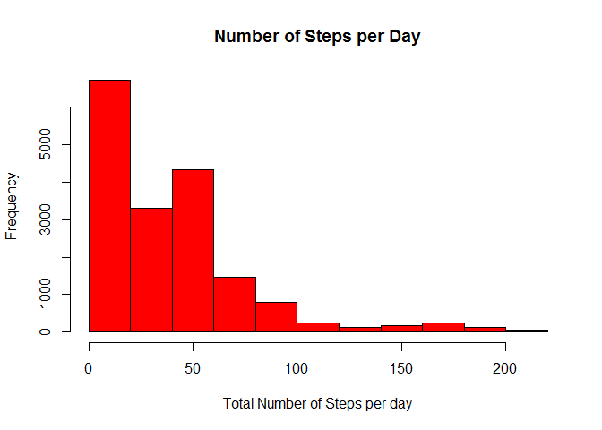

# Reproducible Research: Peer Assessment 1


## Loading and preprocessing the data


```r
suppressMessages(library(dplyr))
suppressMessages(library(lubridate))
stringsAsFactors=FALSE
activity <- read.table(unz("repdata_data_activity.zip", "activity.csv"),
                       header = TRUE, sep = ",")
```

## What is mean total number of steps taken per day?


```r
stepsPerDay <- activity %>% select(date, steps) %>% group_by(date) %>% 
  summarize(mean(steps, na.rm = TRUE))
names(stepsPerDay) <- c("date", "sum")
```

1. Make a histogram of the total number of steps taken each day


```r
hist(stepsPerDay$sum, 
     freq = TRUE,
     col = 'red', 
     xlab = 'Total Number of Steps per day',
     breaks = 10,
     main = 'Number of Steps per Day')
```

 

```r
dev.copy(png, file = 'figures/plot1.png', height=480, width=480)
```

png 
  3 

```r
dev.off()
```

png 
  2 

```r
stepsPerDayMean <- mean(stepsPerDay$sum, na.rm = TRUE)
stepsPerDayMedian <- median(stepsPerDay$sum, na.rm = TRUE)
```

2. Calculate and report the mean and median total number of steps taken per day

Variable       |  mean       |         median
---------------|-------------|-----------------------
Steps Per Day  | 37.3826 | 37.3785

## What is the average daily activity pattern?

1. Make a time series plot of the 5-minute interval and the ave number steps


```r
intervalPerDayMean <- activity %>% group_by(interval) %>% 
  summarize(mean(steps, na.rm = TRUE))
names(intervalPerDayMean) <- c("interval", "MeanSteps")
intervalLevels <- levels(factor(activity$interval))
par(mar = c(4.5,4.5,1,1))
plot(intervalPerDayMean$MeanSteps ~ intervalLevels, type = "l",
     ylab = "number of steps", xlab = "interval levels", col = "red")
```

 

```r
dev.copy(png, file = 'figures/plot2.png', height=480, width=960)
```

png 
  3 

```r
dev.off()
```

png 
  2 

2. Which 5-minute interval on average contains the maximum number of steps


```r
max5MinMeanValue <- max(intervalPerDayMean$MeanSteps)
max5MinMeanRow <- which(intervalPerDayMean$MeanSteps == max5MinMeanValue)
max5MinMeanInterval <- intervalPerDayMean[row(intervalPerDayMean) == 
                                            max5MinMeanRow,][1,1]
```

**The (835) 5-minute interval contains 
206 maximum number 
of steps in average across all days: 
**

## Imputing missing values

1. Calculate and report the total number of missing values in the dataset


```r
iSteps <- which(is.na(activity[,1]) == TRUE)
jInterval <- activity[iSteps,3]
activity[iSteps, 1] <- intervalPerDayMean[,2]
```

**Total number of missing values rows in the dataset is: 2304**

2. Devise a strategy for filling in all of the missing values in the dataset.

   - Strategy is to fill in the missing values with the average of all steps
     values in a particular interval


```r
missingvals = c(NA)

meanVector <- activity %>% group_by(interval) %>% summarize(avg_steps = 
              mean(steps, na.rm = TRUE, na.inf = na.omit))
```

3. Create a new dataset that is equal to the original dataset but missing
   values filled in


```r
newActivity <- tbl_df(activity)

newActivity <- cbind(newActivity, meanVector)

newActivityVector <- data.frame(newActivity$avg_steps)
newActivityVector <- cbind(newActivityVector, newActivity$date)
newActivityVector <- cbind(newActivityVector, newActivity$interval)

names(newActivityVector) <- c("steps", "date", "interval")
```
   
4. Make a histogram of the total number of steps taken each day and 
   Calculate and report the mean and median total number of steps taken per day.
   

```r
hist(newActivityVector$steps, 
     freq = TRUE,
     col = 'red', 
     xlab = 'Total Number of Steps per day',
     breaks = 10,
     main = 'Number of Steps per Day')
```

 

```r
dev.copy(png, file = 'figures/plot3.png', height=480, width=480)
```

png 
  3 

```r
dev.off()
```

png 
  2 

```r
meanf <- newActivityVector %>% group_by(date) %>% 
  summarize(avg_steps = mean(steps)) 
medianf <- newActivityVector %>% group_by(date) %>% summarize(med_steps = median(steps))
```

Variable       |  mean       |         median
---------------|-------------|-----------------------
Steps Per Day  | 37.3826 | 34.1132

## Are there differences in activity patterns between weekdays and weekends?

>Yes. It depends how reliable may a technique for filling be in regards to the NA data. Although, in this case mean values are matched, median value is biased to the left.

1. Create a new factor variable in the dataset with two levels - "weekday"
   and "weekend" indicating whether a given date is a weekday or weekend day.
   

```r
weekdays1 <- c('Mon', 'Tue', 'Wed', 'Thu', 'Fri')
activity <- activity %>% mutate(daytype = 
                                  factor((weekdays(as.POSIXlt(activity$date),
                                                   abbr = TRUE) %in% 
                                            weekdays1)+1L, levels = 1:2,
                                         labels = c("weekend", "weekday")))
```
   
2. Make a panel plot containing a time series plot of the 5-minute interval 
   (x-axis) and the average number of steps taken, averaged across all weekday 
   days or weekend days (y-axis).
   

```r
par(mfrow = c(2, 1))
par(mar = c(2.5,2.5,1,1))

intervalLevels <- levels(factor(activity$daytype, activity$interval))
```

```
## Warning in `levels<-`(`*tmp*`, value = if (nl == nL) as.character(labels)
## else paste0(labels, : duplicated levels in factors are deprecated
```

```r
plot(activity$steps ~ intervalLevels, type = "l",
     ylab = "number of steps", xlab = "interval levels", col = "red")
dev.copy(png, file = 'figures/plot4.png', height=480, width=960)
```

png 
  3 

```r
dev.off()
```

png 
  2 
